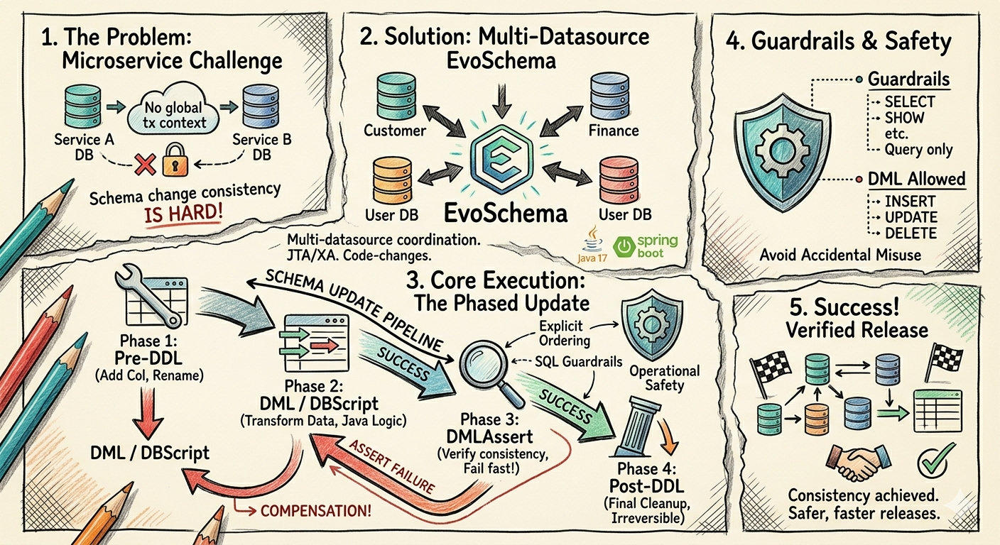

# EvoSchema

[](LICENSE)
[](pom.xml)

EvoSchema is a code-driven database migration framework for microservices architectures, designed to ensure operational safety during major release rollouts.

It uses a phase-based execution model (Pre-DDL → DML / Script → Assert → Post-DDL) to manage schema and data evolution across one or more datasources, with built-in SQL guardrails, multi-datasource coordination (JTA/XA), and developer-defined rollback strategies.

It focuses on operational safety for major releases: explicit ordering, developer-defined compensation SQL for limited rollback, and SQL guardrails (DML-only, DML+query, query-only) to reduce accidental misuse.

> New here? Start with the guided demo: [Getting Started With TutorialOrderSyncDemo](docs/getting-started-tutorial-order-sync.md)

Quick links:

- [Getting Started With TutorialOrderSyncDemo](docs/getting-started-tutorial-order-sync.md)
- [Chinese README](README.zh-CN.md)
- [TutorialOrderSyncDemo.java](src/test/java/io/github/evoschema/dbscript/TutorialOrderSyncDemo.java)
- [TutorialOrderSyncDemoTest.java](src/test/java/io/github/evoschema/TutorialOrderSyncDemoTest.java)



## What It Solves

In a microservice architecture, each service usually owns its own database schema. During a major version rollout, several services may need to evolve their schemas and data at roughly the same time.

This creates a hard engineering problem:

- schema changes often need release-level consistency
- databases are independent, so there is no shared cross-service transaction context
- MySQL DDL is generally not rollback-friendly because of implicit commits

EvoSchema does not try to solve this as a global distributed transaction platform.

Instead, it provides a practical engineering model:

- define migration logic in code
- split execution into ordered phases
- support multi-datasource execution
- provide limited rollback through developer-defined compensation SQL
- apply SQL guardrails to reduce accidental misuse

## Project Positioning

EvoSchema is:

- a non-web Spring Boot application
- a single-process migration executor
- an annotation-driven database evolution framework
- suitable for controlled release pipelines and internal migration runners

EvoSchema is not:

- a cross-microservice orchestration control plane
- a distributed strong-consistency release system
- a full SQL sandbox over every possible JDBC entry point
- a generic Flyway/Liquibase replacement focused on pure SQL files

## Core Execution Model

The framework executes one migration component at a time and follows this phase order:

```text
Pre-DDL -> DML / DBScript -> DMLAssert -> Post-DDL
```

### Pre-DDL

Use `@DBPREDDL` for preparatory structural changes.

- typically used for `CREATE`, `ALTER`, `RENAME`, permission changes, or compatibility preparation
- each method returns two SQL strings:
  - forward SQL
  - compensation SQL
- if a later phase fails, EvoSchema tries to execute compensation SQL in reverse order

### DML

Use `@DBDML` for standard data changes.

- returns a list of SQL statements
- current implementation only allows:
  - `INSERT`
  - `UPDATE`
  - `DELETE`
- `REPLACE`, `MERGE`, `CALL`, and DDL are rejected for this annotation

### DBScript

Use `@DBScript` for more complex migration logic in Java code.

- receives restricted `JdbcTemplate` parameters via `@TargetDBTemplate`
- allows common string-SQL entry points for:
  - DML: `INSERT`, `UPDATE`, `DELETE`, `REPLACE`, `MERGE`, `CALL`
  - query: `SELECT`, `SHOW`, `EXPLAIN`, `DESCRIBE`, `DESC`
- rejects DDL through guarded template validation

### DMLAssert

Use `@DBDMLAssert` for release-time data assertions.

- intended for consistency checks after DML / DBScript
- receives query-only `JdbcTemplate`
- allows:
  - `SELECT`
  - `SHOW`
  - `EXPLAIN`
  - `DESCRIBE`
  - `DESC`
- throws an exception when assertion logic fails

### Post-DDL

Use `@DBPOSTDDL` for cleanup or final structural changes.

- usually contains irreversible operations such as column cleanup or final shape consolidation
- returns forward SQL only
- does not provide compensation SQL

## Transaction and Rollback Model

EvoSchema supports two transaction modes:

- single datasource: local transaction
- multiple datasources: Atomikos JTA/XA transaction

Important limitations:

- rollback support is limited and phase-aware
- `Pre-DDL` rollback depends on developer-provided compensation SQL
- `Post-DDL` is not automatically rollbackable
- database-native DDL rollback is still constrained by the underlying database

## Current Technical Stack

- Java 17
- Spring Boot 3.5.x
- Currently MySQL-only; support for mainstream databases such as PostgreSQL is planned in future releases
- XA support is currently MySQL-only; broader database support will be expanded progressively

## Installation

### 1. Add the project

Build with Maven:

```bash
mvn clean package
```

### 2. Prepare runtime configuration

The application loads datasource configuration from:

```text
classpath:${profiles.prefixpath}/db.properties
```

The default runtime properties are in [`src/main/resources/application.properties`](src/main/resources/application.properties).

Relevant keys:

```properties
spring.profiles.active=dev
logging.config=classpath:${profiles.prefixpath}/log4j2.xml
spring.jta.atomikos.properties.max-timeout=3000000
spring.jta.atomikos.properties.default-jta-timeout=3000000
```

## Datasource Configuration

Configure datasources in `db.properties` using this format:

```properties
evoschema.datasource.customer.driverClassName=com.mysql.cj.jdbc.Driver
evoschema.datasource.customer.url=jdbc:mysql://127.0.0.1:3306/customer_db?useUnicode=true&characterEncoding=utf8&serverTimezone=UTC
evoschema.datasource.customer.username=root
evoschema.datasource.customer.password=123456

evoschema.datasource.finance.driverClassName=com.mysql.cj.jdbc.Driver
evoschema.datasource.finance.url=jdbc:mysql://127.0.0.1:3306/finance_db?useUnicode=true&characterEncoding=utf8&serverTimezone=UTC
evoschema.datasource.finance.username=root
evoschema.datasource.finance.password=123456
```

### Naming Rules

For datasource key `customer`, EvoSchema automatically registers:

- `customerDataSource`
- `customerJdbcTemplate`

For datasource key `finance`, EvoSchema automatically registers:

- `financeDataSource`
- `financeJdbcTemplate`

## How To Write a Migration Component

Use [`DBScriptTemplate.java`](src/main/java/io/github/evoschema/dbscript/DBScriptTemplate.java) as the scaffold.

### Step 1. Copy the template

Create a new class and rename it, for example:

```java
package io.github.evoschema.dbscript;

import com.google.common.collect.ImmutableList;
import io.github.evoschema.annotation.DBDML;
import io.github.evoschema.annotation.DBDMLAssert;
import io.github.evoschema.annotation.DBPOSTDDL;
import io.github.evoschema.annotation.DBPREDDL;
import io.github.evoschema.annotation.DBScript;
import io.github.evoschema.annotation.TargetDBTemplate;
import java.util.List;
import org.springframework.jdbc.core.JdbcTemplate;
import org.springframework.stereotype.Component;

@Component("release_20260401")
public class Release20260401Migration
{
    @DBPREDDL(order = 1, dataSource = "customer")
    public List<String> preDDL()
    {
        return ImmutableList.of(
                "ALTER TABLE customer_orders ADD COLUMN archived TINYINT DEFAULT 0;",
                "ALTER TABLE customer_orders DROP COLUMN archived;"
        );
    }

    @DBDML(order = 1, dataSource = "customer")
    public List<String> dml()
    {
        return ImmutableList.of(
                "UPDATE customer_orders SET archived = 0 WHERE archived IS NULL"
        );
    }

    @DBScript(order = 2)
    public void script(
            @TargetDBTemplate(dataSource = "customer") JdbcTemplate customerTemplate,
            @TargetDBTemplate(dataSource = "finance") JdbcTemplate financeTemplate)
    {
        Long count = customerTemplate.queryForObject(
                "SELECT COUNT(1) FROM customer_orders WHERE archived = 0",
                Long.class
        );
        if (count != null && count > 0) {
            financeTemplate.update(
                    "UPDATE finance_orders SET sync_status = 'READY' WHERE sync_status IS NULL"
            );
        }
    }

    @DBDMLAssert(order = 3)
    public void dmlAssert(@TargetDBTemplate(dataSource = "customer") JdbcTemplate customerTemplate)
    {
        Long count = customerTemplate.queryForObject(
                "SELECT COUNT(1) FROM customer_orders WHERE archived IS NULL",
                Long.class
        );
        if (count != null && count > 0) {
            throw new IllegalStateException("archived column still contains null values");
        }
    }

    @DBPOSTDDL(order = 1, dataSource = "customer")
    public List<String> postDDL()
    {
        return ImmutableList.of(
                "ALTER TABLE customer_orders MODIFY COLUMN archived TINYINT NOT NULL DEFAULT 0"
        );
    }
}
```

### Step 2. Add `@Component`

The component name is the runtime entry id.

For example:

```java
@Component("release_20260401")
```

### Step 3. Choose datasources by name

Use `dataSource = "customer"` or inject templates with:

```java
@TargetDBTemplate(dataSource = "customer")
```

The datasource name must match the keys in `db.properties`.

## Annotation Reference

### `@DBPREDDL`

- phase: before DML
- returns: exactly 2 SQL statements
- purpose: forward DDL + compensation DDL

Example:

```java
@DBPREDDL(order = 1, dataSource = "customer")
public List<String> preDDL()
{
    return ImmutableList.of(
            "ALTER TABLE customer_orders ADD COLUMN ext_id BIGINT DEFAULT NULL",
            "ALTER TABLE customer_orders DROP COLUMN ext_id"
    );
}
```

### `@DBDML`

- phase: DML
- returns: list of standard DML SQL
- allowed first keywords:
  - `INSERT`
  - `UPDATE`
  - `DELETE`

Example:

```java
@DBDML(order = 1, dataSource = "customer")
public List<String> fixData()
{
    return ImmutableList.of(
            "UPDATE customer_orders SET status = 'READY' WHERE status = 'NEW'"
    );
}
```

### `@DBScript`

- phase: DML
- style: Java logic with restricted `JdbcTemplate`
- use when SQL alone is not expressive enough

Example:

```java
@DBScript(order = 2)
public void sync(
        @TargetDBTemplate(dataSource = "customer") JdbcTemplate customerTemplate,
        @TargetDBTemplate(dataSource = "finance") JdbcTemplate financeTemplate)
{
    List<Long> orderIds = customerTemplate.queryForList(
            "SELECT order_id FROM customer_orders WHERE status = 'READY'",
            Long.class
    );
    for (Long orderId : orderIds) {
        financeTemplate.update(
                "UPDATE finance_orders SET sync_status = 'SYNCED' WHERE order_id = ?",
                orderId
        );
    }
}
```

### `@DBDMLAssert`

- phase: after DML / DBScript
- style: query-only assertion logic
- purpose: fail fast when expected data state is not satisfied

Example:

```java
@DBDMLAssert(order = 3)
public void assertResult(@TargetDBTemplate(dataSource = "customer") JdbcTemplate template)
{
    Long count = template.queryForObject(
            "SELECT COUNT(1) FROM customer_orders WHERE status = 'READY'",
            Long.class
    );
    if (count == null || count == 0L) {
        throw new IllegalStateException("no READY records found");
    }
}
```

### `@DBPOSTDDL`

- phase: final structural cleanup
- returns: forward SQL only

Example:

```java
@DBPOSTDDL(order = 1, dataSource = "customer")
public List<String> postDDL()
{
    return ImmutableList.of(
            "ALTER TABLE customer_orders DROP COLUMN old_status"
    );
}
```

## How To Run

Run by component name:

```bash
mvn -q -DskipTests compile
mvn -q exec:java -Dexec.args="release_20260401"
```

Or invoke the starter directly:

```java
Starter.main(new String[] { "release_20260401" });
```

If no argument is passed, the entry component defaults to the current date in `yyyyMMdd` format.

## SQL Guardrails

Current SQL restrictions are:

### `@DBDML`

- allowed:
  - `INSERT`
  - `UPDATE`
  - `DELETE`
- rejected:
  - `REPLACE`
  - `MERGE`
  - `CALL`
  - DDL

### `@DBScript`

- allowed:
  - `INSERT`
  - `UPDATE`
  - `DELETE`
  - `REPLACE`
  - `MERGE`
  - `CALL`
  - `SELECT`
  - `SHOW`
  - `EXPLAIN`
  - `DESCRIBE`
  - `DESC`
- rejected:
  - DDL

### `@DBDMLAssert`

- allowed:
  - `SELECT`
  - `SHOW`
  - `EXPLAIN`
  - `DESCRIBE`
  - `DESC`
- rejected:
  - DML
  - DDL

Note:

- the guard currently focuses on common string-SQL `JdbcTemplate` entry points
- it is not a full sandbox over every possible JDBC API

## Recommended Release Pattern

For a multi-step change, prefer this pattern:

1. use `Pre-DDL` to add compatible schema
2. use `DBDML` / `DBScript` to backfill or transform data
3. use `DBDMLAssert` to verify correctness
4. use `Post-DDL` to finalize structure

This pattern reduces rollout risk and makes failures easier to understand and handle.

## Testing

The repository includes both integration tests and unit tests.

Current test coverage focuses on:

- happy-path execution of all migration phases
- rollback of completed `Pre-DDL` when a later `Pre-DDL` fails
- rollback of DML / DBScript plus compensation of `Pre-DDL`
- SQL guard behavior
- guarded `JdbcTemplate` behavior
- dynamic singleton lifecycle for manually registered datasource beans

Run all tests:

```bash
mvn -q test
```

Representative test classes:

- [TutorialOrderSyncDemoTest](src/test/java/io/github/evoschema/TutorialOrderSyncDemoTest.java)
- [RollbackOnPreDdlFailureDemoTest](src/test/java/io/github/evoschema/RollbackOnPreDdlFailureDemoTest.java)
- [RollbackOnDmlFailureDemoTest](src/test/java/io/github/evoschema/RollbackOnDmlFailureDemoTest.java)
- [SqlStatementGuardTest](src/test/java/io/github/evoschema/SqlStatementGuardTest.java)
- [GuardedJdbcTemplateTest](src/test/java/io/github/evoschema/GuardedJdbcTemplateTest.java)
- [SpringBeanFactoryTest](src/test/java/io/github/evoschema/SpringBeanFactoryTest.java)

## Limitations

- EvoSchema coordinates one migration component per process run
- rollback is limited to what the framework and your compensation SQL can express
- `Post-DDL` is not rollbackable by design

## License

This project is licensed under the MIT License.

See [`LICENSE`](LICENSE) for the full text.
- it does not coordinate multiple microservices as a central orchestrator
- it does not guarantee global release atomicity across independent services

## When To Use EvoSchema

Use it when you need:

- code-reviewed database evolution logic
- explicit phase ordering
- controlled multi-datasource migration execution
- release-time assertions
- a pragmatic alternative to fully manual migration playbooks

## Contributing

Recommended contribution checklist:

1. keep migration behavior explicit and easy to audit
2. add or update tests for new execution paths
3. avoid widening SQL permissions without test coverage
4. document new datasource or runtime conventions in this README
